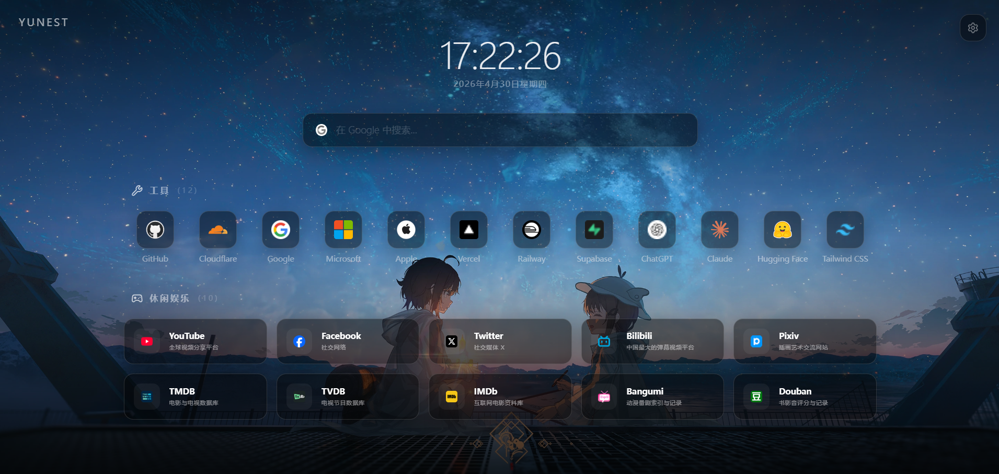

<div align="center">
    <p>
        <a href="README.zh.md">简体中文</a> | English
    </p>
    <p align="center">
    
    
    
    
    
  </p>
  <h1>YuNest - Personal Navigation Hub</h1>
  <p><strong><a href="https://nav.072199.xyz/">🚀 Click to Visit Demo Site</a></strong> (Password: <code>admin1234</code>)</p>
  <p>A modern, beautiful, and highly customizable personal static navigation and bookmark management tool.</p>
  <p>Since YuNest is a pure frontend static application, you can easily perform <a href="#-local-run--development">Local Deployment</a> or <a href="#-static-hosting-cloud-deployment">Static Hosting Cloud Deployment</a> (click to jump).</p>
</div>



## ✨ Features

YuNest focuses on providing the most elegant "Start Page" experience. All content is stored locally in the browser, requiring no backend database.

- 🎨 **Premium Aesthetic Design**: Features Glassmorphism and Aurora lighting effects, with smooth entrance and hover micro-animations. Minimalist yet sophisticated.
- 🖼️ **Powerful Wallpaper Management**: 
  - Supports **Solid Colors** (fully customizable), **Static Images**, **Random Image APIs**, and **Local File Uploads**.
  - Toggle "Glassmorphism Blur" and "Dark Mask" for optimal visibility and contrast across different wallpapers.
- 🔍 **Multi-Engine Search Integration**: Built-in engine switching (Google, Bing, Baidu, etc.) with **Real-time Local Bookmark Search**: filter bookmarks as you type without pressing Enter.
- 🔖 **Flexible Bookmark Management**: 
  - **Diverse Layouts**: Switch between "Detailed Cards" (with descriptions and side icons) and "Compact Grid" (App drawer style) for each category.
  - Automatic Favicon grabbing or manual icon selection (Lucide Icon sets or Custom URLs).
  - **Dual Network Address Support**: Configure both "Default" and "Intranet" URLs. Toggle between them via the **Right-click Menu** on the homepage — perfect for HomeLab/NAS users.
- 🔐 **Privacy & Visibility Control**:
  - **Hidden Categories**: Set specific bookmark categories to "Hidden". These and their contents are completely invisible to guests and only appear dynamically after admin authentication.
- 🛡️ **Secure Admin Panel**: Built-in password-protected management interface. Customize the access password via environment variables.
- 💾 **Cloud Sync & Persistence**: 
  - Default storage in `localStorage`. Supports JSON backup/restore.
  - **GitHub API Integration**: Sync data to your repository's `data/yunest_data.json` (Recommended). Separate data updates from code deployments using Build Watch Paths.
- 🚀 **Performance Optimized**: 
  - **Zero-Latency Icons**: Icon solidification tech and CDN caching ensure instant rendering even on slow connections.
  - **Zero-Dependency Deployment**: Uses `HashRouter` for perfect compatibility with Cloudflare Pages, Vercel, and GitHub Pages without extra redirection config.

## 🛠️ Tech Stack

- **Framework**: [React 18](https://react.dev/)
- **Language**: [TypeScript](https://www.typescriptlang.org/)
- **Build Tool**: [Vite](https://vitejs.dev/)
- **Styling**: [Tailwind CSS v4](https://tailwindcss.com/)
- **Routing**: [React Router](https://reactrouter.com/) (HashRouter)
- **Icons**: [Lucide React](https://lucide.dev/)

---

## 📋 Prerequisites

Before starting the deployment, it is recommended to prepare the credentials required for GitHub automatic synchronization (optional but highly recommended):

1. **Get GitHub Token**:
   - Visit GitHub [Settings -> Developer settings](https://github.com/settings/tokens).
   - Generate a new **Personal Access Token (classic)**.
   - **Scopes**: Select **`repo`** for private repositories or **`public_repo`** for public repositories.
2. **Determine Sync Repo Name**:
   - Format is `YourUsername/RepoName`, e.g., `YUME-0721/YuNest`.
   - **Privacy Suggestion**: If you want your code to be public but your bookmark data private, it is recommended to create a separate **Private Repository** for data storage.

---

## 🚀 Deployment

YuNest provides an extremely simple deployment process.

### 💻 Local Run & Development

Suitable for users who want to customize the code further or run it in a private local network.

1. **Prerequisites**: Ensure you have [Node.js](https://nodejs.org/) (v18+ recommended) installed.
2. **Clone the Repo**:
   ```bash
   git clone https://github.com/YUME-0721/YuNest.git
   cd YuNest
   ```
3. **Install Dependencies**:
   ```bash
   npm install
   ```
4. **Environment Config**:
   - Copy `.env.example` to `.env`.
   - **VITE_ADMIN_PASSWORD**: Set your admin panel password (required, default `123456`).
   - **VITE_GITHUB_TOKEN / REPO**: Enter the credentials prepared above.
5. **Start Dev Server**:
   ```bash
   npm run dev
   ```
   - Visit the output URL (usually `http://localhost:5173`).

---

### ☁️ Static Hosting Cloud Deployment

**Most Recommended.** YuNest can run permanently for free as a static site.

#### 1. Quick Deployment (Cloudflare Pages / Vercel)
1. **Fork this Repo**: Click **Fork** to copy the code to your GitHub account.
2. **Import Project**: Log in to [Cloudflare Dashboard](https://dash.cloudflare.com/) or Vercel and import your forked repo.
3. **Build Config**:
   - **Build Command**: `npm run build`
   - **Output Directory**: `dist`
4. **Environment Variables**:
   - Add the following in the platform's Environment Variables settings:
     - **VITE_ADMIN_PASSWORD**: Your admin panel password (Required).
     - **VITE_GITHUB_TOKEN**: Your token (Optional).
     - **VITE_GITHUB_REPO**: Your sync repo name (Optional).
5. **🚀 Cloudflare Optimization (Recommended)**:
   - **Steps**: Go to **Settings -> Build & deployment -> Build watch paths**.
   - **Exclude**: Add `data/*` in **Excluded paths**. This prevents data sync from triggering redundant build tasks.

#### 2. Manual Server Deployment (Nginx / Apache)
Run `npm run build` and upload the contents of the `dist` folder to your web server's root directory.

---

## 🛡️ Security & Privacy
- **Encrypted Sync**: Data is saved to `data/yunest_data.json` on the `main` branch.
- **Token Masking**: Sensitive tokens are removed before syncing to ensure data files are safe.
- **Local First**: Manual refreshes won't overwrite unsynced local changes.

## 📄 License

This project is licensed under the **GNU General Public License v3.0 (GPL-3.0)**.

- **Free Software**: You are free to run, study, share, and modify the software.
- **Copyleft**: If you distribute modified versions of the project, they must be licensed under the same GPL-3.0 license.
- **Refer to the `LICENSE` file for the full text.**

